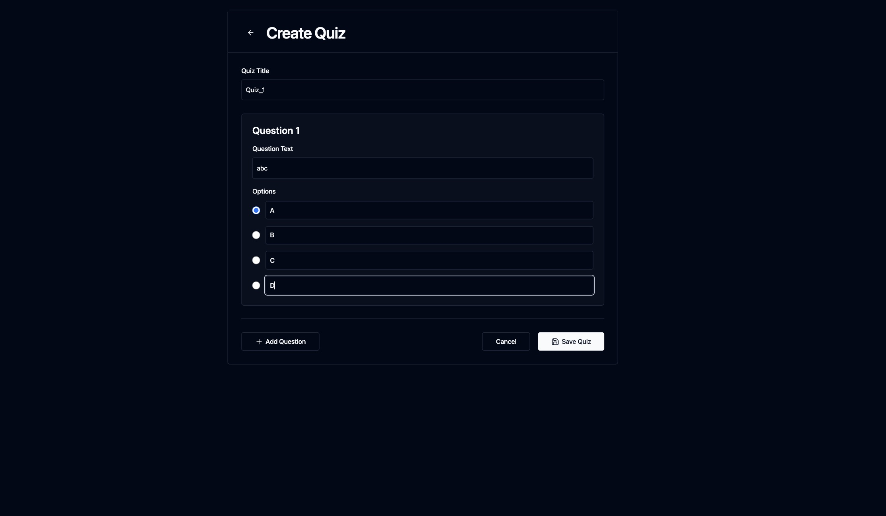
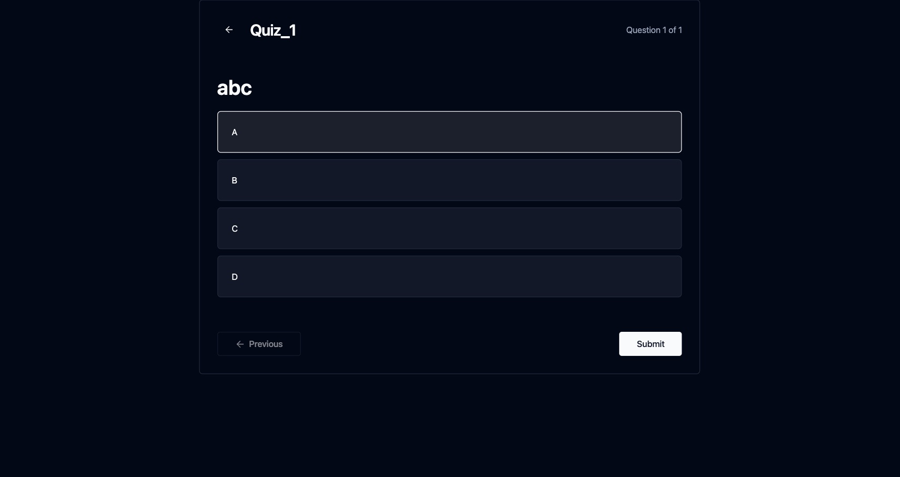
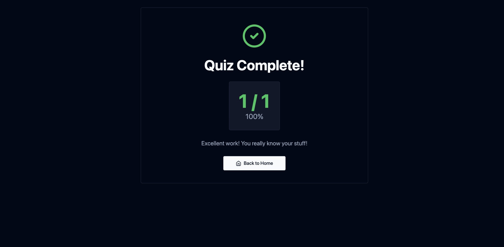

# Quiz App

A quiz application built with React.js.

This project is a simple quiz web app where users can answer multiple-choice questions and see their score at the end. It was built to practice React fundamentals like component structure, state management, routing, and styles.

## About

This app renders questions one at a time, allows the user to select an answer, and shows the final result after all questions are answered. It uses React for UI and basic JavaScript logic for quiz flow.

## Screenshots








## Built With

- React.js
- JavaScript
- CSS
- Vite (React tooling)

## Run Locally

1. Clone the repo:
```bash
git clone https://github.com/Prathu3110/Quiz_app.git
```
3. Navigate into the folder:

```bash
cd Quiz_app
```
3. Install dependencies:

```bash
npm install
```
4. Start the development server:

```bash
npm run dev
```


